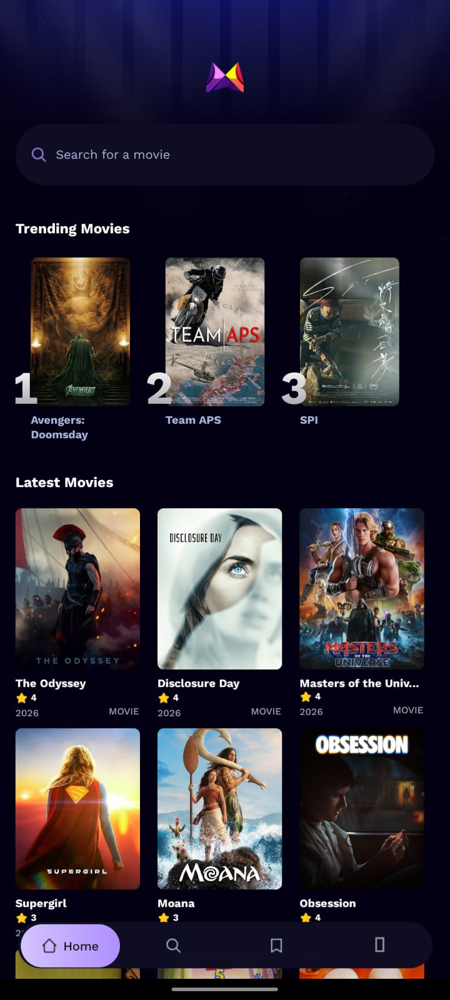
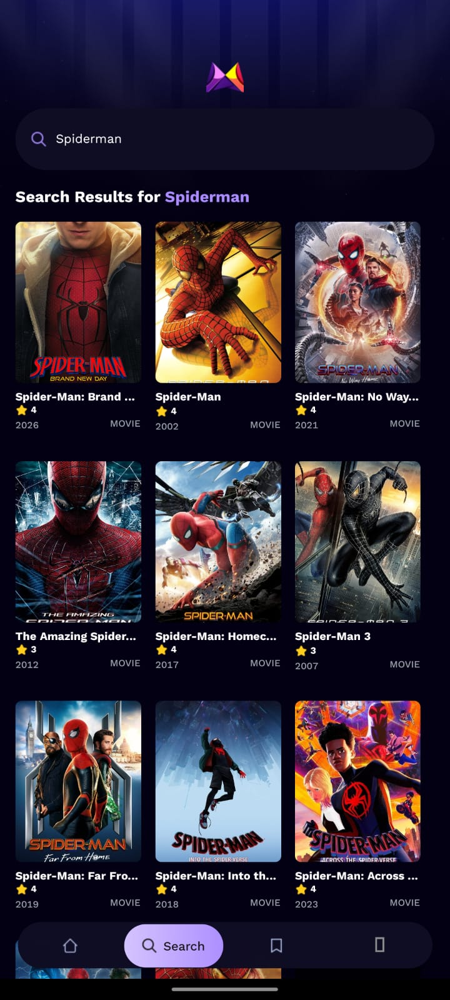
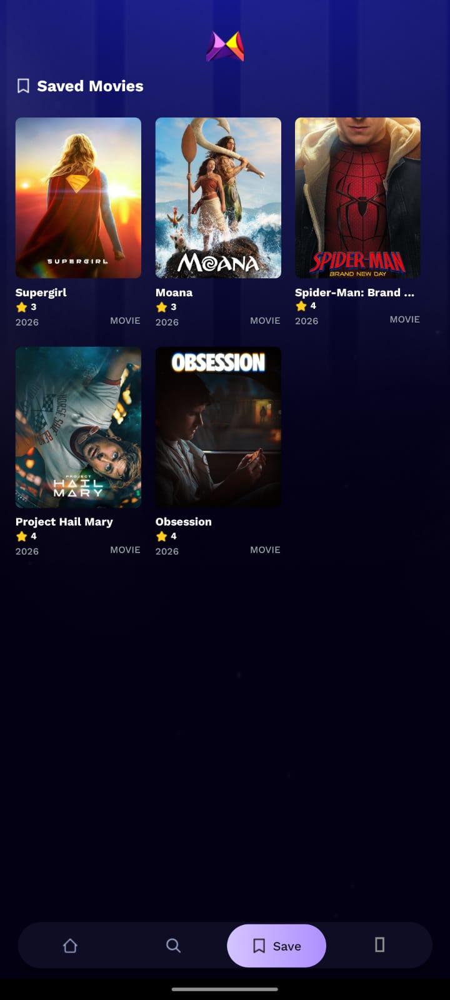

<div align="center">

# 🎬 MovieFlix

A modern cross-platform movie discovery application built with **React Native**, **Expo**, **TypeScript**, **NativeWind**, **TMDB API**, and **Appwrite**.


</div>


# 📋 Table of Contents

- [Introduction](#-introduction)
- [Screenshots](#-screenshots)
- [Features](#-features)
- [Tech Stack](#️-tech-stack)
- [Installation](#-installation)
- [Environment Variables](#-environment-variables)
- [Running the Project](#-running-the-project)
- [Future Enhancements](#-future-enhancements)


# 🤖 Introduction

**MovieFlix** is a modern cross-platform movie discovery application that enables users to explore trending movies, search through thousands of titles, view comprehensive movie details, and save their favorite movies for later viewing.

Powered by the **TMDB API**, MovieFlix delivers real-time movie information including ratings, genres, release dates, runtime, production companies, and more. Search analytics are stored using **Appwrite**, allowing the application to generate a dynamic trending movies section based on user activity. Built with **Expo Router**, **TypeScript**, and **NativeWind**, MovieFlix offers a smooth, responsive, and visually appealing experience on both Android and iOS.

---

# 📱 Screenshots

<table align="center">
<tr>

<td align="center">
<b>🏠 Home</b><br/><br/>

</td>

<td align="center">
<b>🔍 Search</b><br/><br/>

</td>

<td align="center">
<b>🎥 Details</b><br/><br/>

</td>

<td align="center">
<b>⭐ Saved</b><br/><br/>

</td>

</tr>
</table>

---

# 🔥 Features

### 🎬 Discover Popular Movies

Browse a curated collection of trending and popular movies fetched directly from the TMDB API with high-quality posters and ratings.

---

### 🔎 Powerful Movie Search

Search thousands of movies instantly with real-time API integration, providing fast and accurate search results.

---

### 📈 Trending Movies

MovieFlix tracks user searches using Appwrite and automatically generates a dynamic list of trending movies based on overall search popularity.

---

### 🎥 Detailed Movie Information

View complete information about every movie, including:

- Movie Overview
- Genres
- Release Date
- Runtime
- Average Rating
- Vote Count
- Budget
- Revenue
- Production Companies

---

### ⭐ Bookmark Favorite Movies

Bookmark any movie with a single tap and save it locally using AsyncStorage for quick access later.

---

### 📚 Saved Movies Library

Access all bookmarked movies from a dedicated **Saved** screen. Saved movies persist across app launches, allowing users to maintain their personal movie collection without needing to search again.

---

### ⚡ Persistent Local Storage

Bookmarks are securely stored using AsyncStorage, ensuring data remains available even after restarting the application.

---

### 🚀 Fast & Smooth Navigation

Built with Expo Router to provide seamless navigation between screens with an intuitive user experience.

---

### 🎨 Modern User Interface

MovieFlix features a visually appealing interface with:

- Elegant Dark Theme
- Responsive Layouts
- High-Resolution Movie Posters
- Smooth Navigation
- Clean Typography
- Mobile-First Design

---

### 📱 Cross-Platform Compatibility

Developed using React Native and Expo, allowing a single codebase to run seamlessly on both Android and iOS devices.

---

### 🏗️ Scalable Architecture

Designed with a clean and maintainable project structure featuring:

- Reusable UI Components
- Custom Hooks
- Service Layer
- Utility Functions
- TypeScript Interfaces
- Organized Folder Structure
- Separation of Business Logic and UI

---

### ⚙️ Real-Time Movie Data

Fetches up-to-date movie information directly from TMDB, ensuring users always see the latest content.

---

### 💨 Optimized Performance

MovieFlix is optimized for speed and responsiveness through:

- Efficient API Requests
- Lightweight Components
- Optimized Rendering
- Fast Screen Transitions
- Responsive User Interactions

---

# ⚙️ Tech Stack

- React Native
- Expo
- Expo Router
- TypeScript
- NativeWind
- AsyncStorage
- Appwrite
- TMDB API

---

# 🚀 Installation

Clone the repository.

```bash
git clone https://github.com/<your-github-username>/movieflix.git

cd movieflix
```

Install dependencies.

```bash
npm install
```

or

```bash
yarn
```

---

# 🔑 Environment Variables

Create a `.env` file in the project root.

```env
EXPO_PUBLIC_MOVIE_API_KEY=

EXPO_PUBLIC_APPWRITE_PROJECT_ID=

EXPO_PUBLIC_APPWRITE_DATABASE_ID=

EXPO_PUBLIC_APPWRITE_COLLECTION_ID=
```

Replace the placeholder values with your own credentials.

- **TMDB API:** https://www.themoviedb.org/settings/api
- **Appwrite:** https://cloud.appwrite.io/

---

# ▶️ Running the Project

Start the Expo development server.

```bash
npx expo start
```

Run on Android.

```bash
npx expo run:android
```

Run on iOS.

```bash
npx expo run:ios
```

Or scan the QR code using **Expo Go** on your mobile device.

---

# 🚀 Future Enhancements

- 🎞️ Watch Movie Trailers
- 👤 User Authentication
- ❤️ Cloud Synchronization of Saved Movies
- 📝 User Reviews & Comments
- ⭐ User Rating System
- 🎭 Browse by Genre
- 🌙 Light & Dark Theme Toggle
- 🔔 Movie Release Notifications
- 📺 TV Shows & Series Support
- 🎬 AI-Based Personalized Recommendations

---

<div align="center">

### ⭐ If you found this project useful, consider giving it a star!

Made with ❤️ using **React Native**, **Expo**, **TypeScript**, **NativeWind**, **Appwrite**, and the **TMDB API**.

</div>
